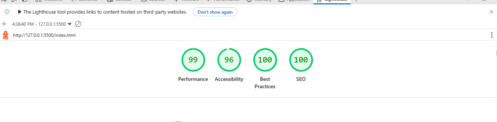

# **Omnifood**

A responsive, single-page website for a hypothetical AI-powered food subscription service.

---

### **🚀 Live Demo**

https://www.omnifood-ai-diet.netlify.app

---

### **📈 Performance Metrics**



---

### **📋 Project Description**

This is a real-world-like website for a company called Omnifood, which provides a healthy, AI-tailored meal delivery service. The site is a front-end demonstration of a product landing page, built to be fully responsive and visually appealing across all devices.

---

## **✨ Features & Principles**

The project was built to showcase modern web design and development principles. It includes:

- **⚙️ SEO & Accessibility**

This project was built with a strong focus on Search Engine Optimization (SEO) and web accessibility. Key elements include:

- **Semantic HTML**: The website uses semantic tags like `<header>`, `<main>`, `<footer>`, `<section>`, and `<figure>` to provide a meaningful structure that is easily understood by search engines and screen readers.

- **Accessibility Features**: The design ensures the site is accessible to all users. This includes:
  - **Alt Text**: All images contain descriptive `alt` attributes to provide context for visually impaired users and improve SEO.
  - **Readable Color Contrast**: The color palette was chosen to ensure high contrast for easy readability.
- **Performance**: The clean HTML and efficient CSS contribute to fast loading times, which is a key factor for both SEO and user experience.

* **Responsive Design**: The layout dynamically adjusts to provide an optimal viewing experience on desktops, tablets, and mobile phones.
* **Web Design Principles**: Implements concepts like visual hierarchy, whitespace, and color theory to create a clean, professional user interface.
* **Grid and Flexbox Layout**: Built using modern CSS layout techniques for a robust and flexible structure.
* **Professional Content**: The website's content is structured to effectively communicate the brand's message, features, and value proposition.

---

### **💻 Technologies Used**

- **HTML**: For the semantic structure of the website.
- **CSS**: For all styling, layout, and visual effects.
- **JavaScript**: Just used for sticky header and mobile navigation.

---

### **⬇️ How to Run the Project**

1.  **Clone the repository**:

    ```bash
    git clone https://github.com/Mhmd-abi-hachem/omnifood-html-css
    ```

2.  **Open `index.html`**:

    Simply open the `index.html` file in your preferred web browser to view the website.
